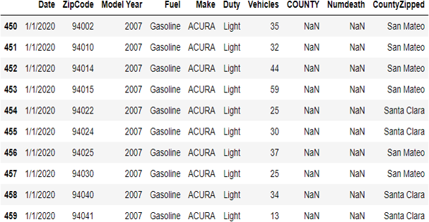
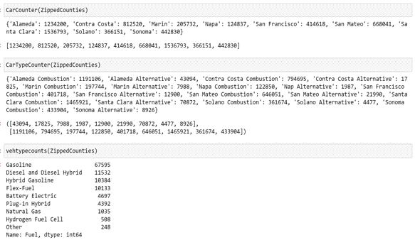

# K-Means Clustering Analysis of Asthma Related Deaths and Fuel Type in the Bay Area

By Mihir Thakar

This Project is going to correlate Vehicle and Health data from 9 counties that make up the Bay Area. I obtained an "Asthma Deaths by County" and "Vehicle Fuel Type by Zip Code" dataset from the CA.gov open data portal. The most important task will involve organizing the zipcoded data into an organized data frame as each county is host to multiple zip codes. From there I will be able to connect whether the fuel type (Hybrid, Elec, Gas) has an affect on the presence of Asthma deaths and create a visualization based on most K-Means Clustering. The final results are then geocoded into chloropleth maps. You can follow my work pipeline below.


## Cleansed Data
First off I cleaned the 2 Datasets.

### Cleaned Asthma Dataset according to the counties


{:style="display:block; margin-left:auto; margin-right:auto"; :height="75%" width="75%"; }
{:refdef: style="text-align: center;"}
*Asthma Frame*
{: refdef}


### Cleaned FuelType Dataset according to the zipcode


{:style="display:block; margin-left:auto; margin-right:auto"; :height="75%" width="75%"; }
{:refdef: style="text-align: center;"}
*Fuel Type Frame*
{: refdef}


### Number of Deaths/County
By creating a dictionary of zipcodes for each County I was able to map each zipcode to the 9 counties of the Bay Area.
I then used a groupby method to find the number of Deaths in each county


{:style="display:block; margin-left:auto; margin-right:auto"; :height="75%" width="75%"; }
{:refdef: style="text-align: center;"}
*Death GroupBy Frame*
{: refdef}


### Functions

- CountyMapper: Maps Each ZipCode in Fuel DataSet to its corresponding County
  - ```python
    def CountyMapper(df):
    CountyZipped = []
    for zipcode in df['ZipCode']:
      a = [k for k, v in CZ_Dict.items() if zipcode in v] #CZ_Dict is the dictionary of county keys and zipcode items
      CountyZipped.append(a)
    df['CountyZipped'] = CountyZipped
    df['CountyZipped'] = df['CountyZipped'].str[0]
    return df
    ```
   

- CarCounter: Counts the cars in each County
- CarTypeCounter: Decided to make the distinction of any combustion engine even if hybrid
  - Combustion = Gasoline, Diesel, Diesel Hybrid, Hybrid Gasoline, Flex-Fuel, Natural Gas, Other
  - Alternative = Battery Electric, Plug-In Hybrid, Hydrogen Fuel Cell
  - ```python
    def CarTypeCounter(df):
      VehTypeCounts = df.groupby(['CountyZipped,'Fuel Type']).Vehicles.sum().reset_index()
      VehicleCounts = VehTypeCounts['Vehicle'].to_numpy()
      Alts = VehicleCounts[::2]
      Combs = VehicleCounts[1::2]
      print(VehTypeCounts)
      return Alts,Combs
    ```
   


### Final Frame Bay Area 
This will be the Final Dataframe on which the K-Means Analysis will be conducted on


{:style="display:block; margin-left:auto; margin-right:auto"; :height="75%" width="75%"; }
{:refdef: style="text-align: center;"}
*Final Frame*
{: refdef}


## Analysis

### PairWise Plots
Some preliminary analysis included a PairWise Plot for the corresponding attributes developed above.
This is a Matrix of scatterplots meant to display correlations between attributes


{:style="display:block; margin-left:auto; margin-right:auto"; :height="75%" width="75%"; }
{:refdef: style="text-align: center;"}
*Pair Wise Plots*
{: refdef}

### K-Means Overview


{:style="display:block; margin-left:auto; margin-right:auto"; :height="75%" width="75%"; }
{:refdef: style="text-align: center;"}
*K-Means Explanation*
{: refdef}


### K-Means Analysis 9 Clusters
After designing the Final Frame I conducted a K-Means Clustering Analysis using 9 clusters for the 9 Counties.


{:style="display:block; margin-left:auto; margin-right:auto"; :height="75%" width="75%"; }
{:refdef: style="text-align: center;"}
*9 Cluster K-Means Analysis*
{: refdef}

The elbow of the Inertia Score determined 3 clusters was the optimal cluster coefficient => 3 triplets of counties were aggregated together based on their similarity.


### K-Means Analysis 3 Clusters
Running the program again using 3 clusters I got the following results


{:style="display:block; margin-left:auto; margin-right:auto"; :height="75%" width="75%"; }
{:refdef: style="text-align: center;"}
*Inertia Score = 3 K-Means Analysis*
{: refdef}

## K-Means Conclusion
```diff
My final results were contrary to my a priori expectations that alternative fuel vehicles would lend to a decreased number of asthma related deaths. This data shows
that a lower combustion vehicle presence and higher alternative presence led to a greater % death rate. This can be attributed to simply there being more cars in
these areas. Although the results were not too fruitful it will be interesting to see how this study will fare 15-30 years down the line after California bans 
the manufacturing of combustion fuel vehicles in 2025.
```

## Choropleth Maps

### Death Percentage
The following provides a visualization on the Death Percentage by Asthma for the Bay Area by County

<iframe src="Maps/DP.html" height="500" width="800"></iframe>

### Alternative Fuel/Combustion Fuel
The following provides a visualization on the ratio between Alternative Fuel Vehicles over Combustion for the Bay Area by County

<iframe src="Maps/AC.html" height="500" width="800"></iframe>

### Number Alternative Fuel Vehicles
The following provides a visualization on the number of Alternative Fuel Vehicles for the Bay Area by County
(Note how Santa Clara has the greatest value this can be attributed to its suburban high income environment)

<iframe src="Maps/AV.html" height="500" width="800"></iframe>
