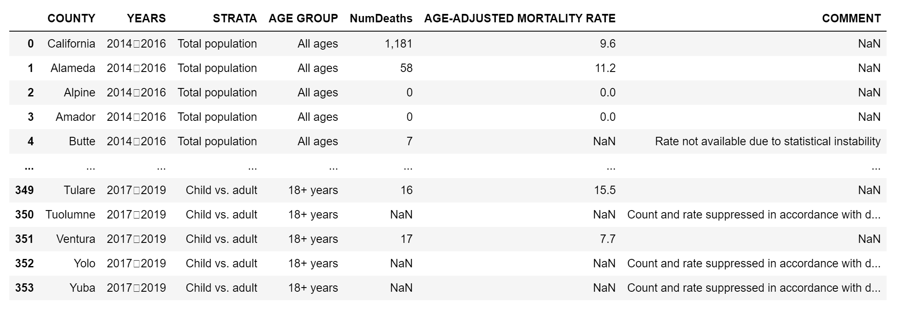
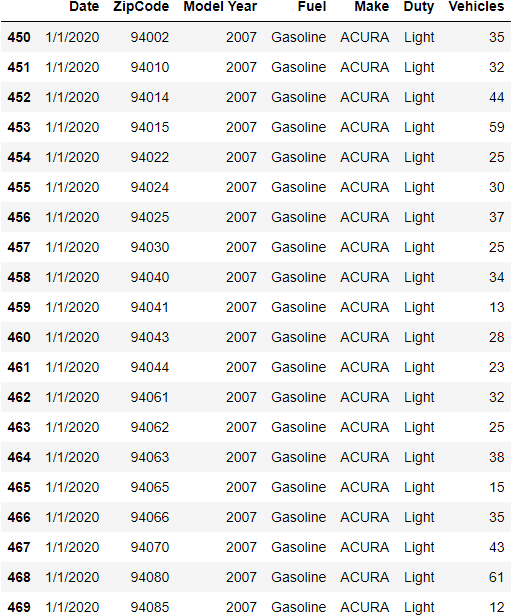
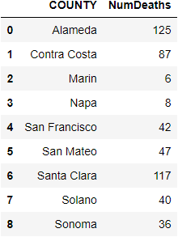
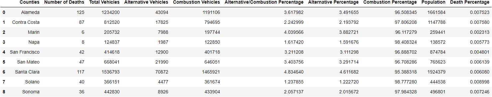
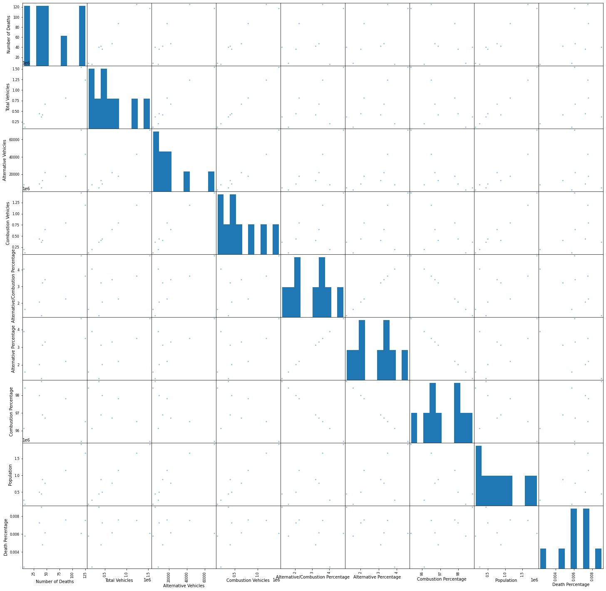
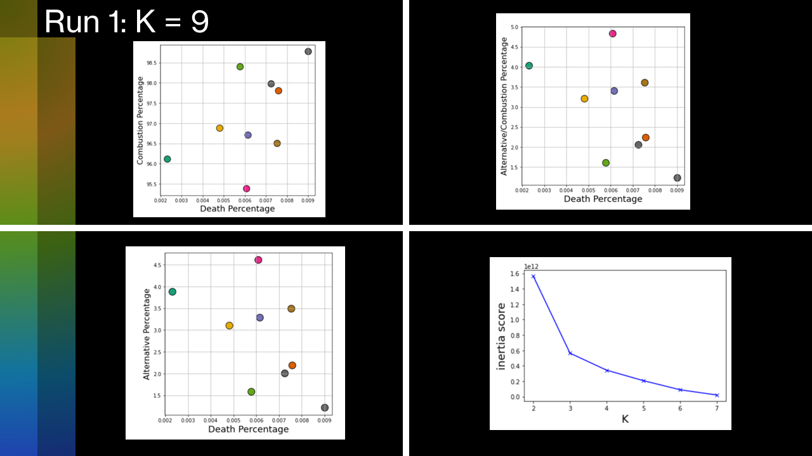
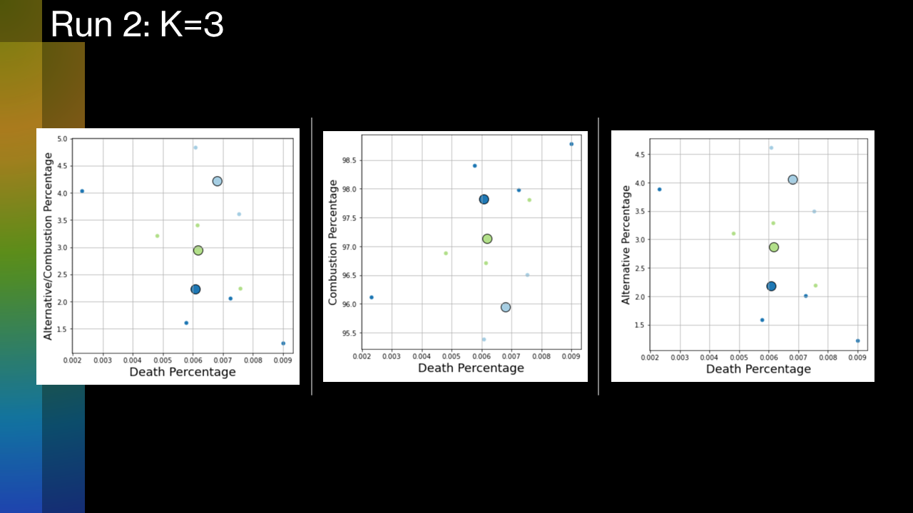

# K-Means Clustering Analysis of Asthma Related Deaths and Fuel Type in the Bay Area

By Mihir Thakar

This Project is going to correlate Vehicle and Health data from 9 counties that make up the Bay Area. I obtained an "Asthma Deaths by County" and "Vehicle Fuel Type by Zip Code" dataset from the CA.gov open data portal. The most important task will involve organizing the zipcoded data into an organized data frame as each county is host to multiple zip codes. From there I will be able to connect whether the fuel type (Hybrid, Elec, Gas) has an affect on the presence of Asthma deaths and create a visualization based on most K-Means Clustering. The final results are then geocoded into chloropleth maps. You can follow my work pipeline below.

First off I cleaned the 2 Datasets.

Here is an example of the cleaned Asthma Dataset according to the counties

{:style="display:block; margin-left:auto; margin-right:auto"; :height="75%" width="75%"; }
{:refdef: style="text-align: center;"}
*Asthma Frame*
{: refdef}

Here is an example of the cleaned FuelType Dataset according to the zipcode

{:style="display:block; margin-left:auto; margin-right:auto"; :height="75%" width="75%"; }
{:refdef: style="text-align: center;"}
*Fuel Type Frame*
{: refdef}

By creating a dictionary of zipcodes for each County I was able to map each zipcode to the 9 counties of the Bay Area.
I then used a groupby method to find the number of Deaths in each county

{:style="display:block; margin-left:auto; margin-right:auto"; :height="75%" width="75%"; }
{:refdef: style="text-align: center;"}
*Death GroupBy Frame*
{: refdef}

The Final results ultimately cleaned the code to analyze only the 9 Bay Area counties to make the following Final Frame

{:style="display:block; margin-left:auto; margin-right:auto"; :height="75%" width="75%"; }
{:refdef: style="text-align: center;"}
*Final Frame*
{: refdef}

Some preliminary analysis included a PairWise Plot for the corresponding attributes developed above.

{:style="display:block; margin-left:auto; margin-right:auto"; :height="75%" width="75%"; }
{:refdef: style="text-align: center;"}
*Pair Wise Plots*
{: refdef}

After designing the Final Frame I conducted a K-Means Clustering Analysis using 9 clusters for the 9 Counties.

{:style="display:block; margin-left:auto; margin-right:auto"; :height="75%" width="75%"; }
{:refdef: style="text-align: center;"}
*9 Cluster K-Means Analysis*
{: refdef}

The elbow of the Inertia Score determined 3 clusters was the optimal cluster coefficient => 3 triplets of counties were aggregated together based on their similarity.

Running the program again using 3 clusters I got the following results

{:style="display:block; margin-left:auto; margin-right:auto"; :height="75%" width="75%"; }
{:refdef: style="text-align: center;"}
*Inertia Score = 3 K-Means Analysis*
{: refdef}

The following provides a visualization on the Death Percentage by Asthma for the Bay Area by County

<iframe src="Maps/DP.html" height="500" width="800"></iframe>

The following provides a visualization on the ratio between Alternative Fuel Vehicles over Combustion for the Bay Area by County

<iframe src="Maps/AC.html" height="500" width="800"></iframe>

The following provides a visualization on the number of Alternative Fuel Vehicles for the Bay Area by County
(Note how the Santa Clara has the greatest value most likely attributed to its suburban high income environment)

<iframe src="Maps/AV.html" height="500" width="800"></iframe>
